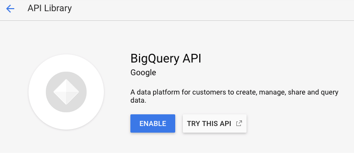
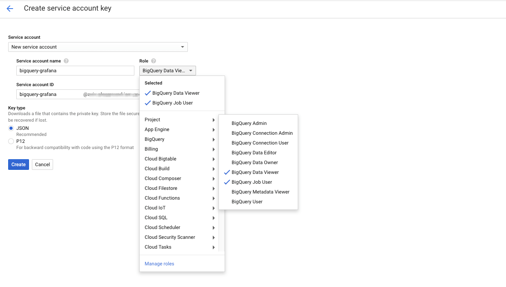

[](https://github.com/doitintl/bigquery-grafana/stargazers)

[](https://circleci.com/gh/doitintl/bigquery-grafana)
[](https://codeclimate.com/github/doitintl/bigquery-grafana/coverage)
[](https://codeclimate.com/github/doitintl/bigquery-grafana)
[](https://codecov.io/gh/doitintl/bigquery-grafana/)
## Status: Ready for Beta Testing
# BigQuery datasource for Grafana

BigQuery datasource plugin provide support for [BigQuery](https://cloud.google.com/bigquery/) as a backend database.  

### Quick start
There are multiple ways to install bigquery-grafana go to [INSTALL](INSTALL.md) for more infromation. 

### Features:

 * Query setup
 * Raw SQL editor
 * Query formatting
 * Macros support
 * Additional functions
 * Table view
 * Annotations
 * Sharded tables (`tablename_YYYYMMDD`)
 * Partitioned Tables
 
 **Plugin Demo:**
 
 
 
 
## Adding the data source to Grafana

1. Open the side menu by clicking the Grafana icon in the top header.
2. In the side menu under the `Dashboards` link you should find a link named `Data Sources`.
3. Click the `+ Add data source` button in the top header.
4. Select `BigQuery` from the _Type_ dropdown.
5. Upload or paste in the Service Account Key file. See below for steps on how to create a Service Account Key file.

> NOTE: If you're not seeing the `Data Sources` link in your side menu it means that your current user does not have the `Admin` role for the current organization.

| Name                  | Description                                                                         |
| --------------------- | ----------------------------------------------------------------------------------- |
| _Name_                | The datasource name. This is how you refer to the datasource in panels & queries.   |
| _Default_             | Default datasource means that it will be pre-selected for new panels.               |
| _Service Account Key_ | Service Account Key File for a GCP Project. Instructions below on how to create it. |

## Authentication

There are two ways to authenticate the BigQuery plugin - either by uploading a Google JWT file, or by automatically retrieving credentials from Google metadata server. The latter option is only available when running Grafana on GCE virtual machine.

### Using a Google Service Account Key File

To authenticate with the BigQuery API, you need to create a Google Cloud Platform (GCP) Service Account for the Project you want to show data for. A Grafana datasource integrates with one GCP Project. If you want to visualize data from multiple GCP Projects then you can give the service account permissions in each project or  create one datasource per GCP Project.

#### Enable APIs

The following APIs need to be enabled first:

* [BigQuery API](https://console.cloud.google.com/apis/library/bigquery-json.googleapis.com)


Click on the links above and click the `Enable` button:



#### Create a GCP Service Account for a Project

1. Navigate to the [APIs & Services Credentials page](https://console.cloud.google.com/apis/credentials).
2. Click on the `Create credentials` dropdown/button and choose the `Service account key` option.

    
3. On the `Create service account key` page, choose key type `JSON`. Then in the `Service Account` dropdown, choose the `New service account` option:

    

4. Some new fields will appear. Fill in a name for the service account in the `Service account name` field and then choose the `Monitoring Viewer` role from the `Role` dropdown:

    
5. Click the Create button. A JSON key file will be created and downloaded to your computer. Store this file in a secure place as it allows access to your Stackdriver data.
6. Upload it to Grafana on the datasource Configuration page. You can either upload the file or paste in the contents of the file.

   
   
7. The file contents will be encrypted and saved in the Grafana database. Don't forget to save after uploading the file!

    

### Using GCE Default Service Account

If Grafana is running on a Google Compute Engine (GCE) virtual machine, it is possible for Grafana to automatically retrieve default credentials from the metadata server. This has the advantage of not needing to generate a private key file for the service account and also not having to upload the file to Grafana. However for this to work, there are a few preconditions that need to be met.

1. First of all, you need to create a Service Account that can be used by the GCE virtual machine. See detailed instructions on how to do that [here](https://cloud.google.com/compute/docs/access/create-enable-service-accounts-for-instances#createanewserviceaccount).
2. Make sure the GCE virtual machine instance is being run as the service account that you just created. See instructions [here](https://cloud.google.com/compute/docs/access/create-enable-service-accounts-for-instances#using).
3. Allow access to the `Stackdriver Monitoring API` scope. See instructions [here](changeserviceaccountandscopes).

Read more about creating and enabling service accounts for GCE VM instances [here](https://cloud.google.com/compute/docs/access/create-enable-service-accounts-for-instances).

### Build

The build works with Yarn:

#### Development build
```
yarn run run build:dev
```

#### Production build
```
yarn run run build:prod
```

Tests can be run with Jest:

```
yarn run test
```

## Contributing

See the [Contribution Guide](./CONTRIBUTING.md).

## License

See the [License File](LICENSE.md).
**